# Developer Guide

## Acknowledgements

At this stage, no third-party libraries, external code, or documentation have been reused. Any future integrations or adaptations will be properly documented here.

## Table of Contents

- [Introduction](##ntroduction)
- [Glossary](#glossary)
- [Getting Started](#getting-started)
- [Design](#design)
  - [Architecture](#architecture)
  - [Main](#main)
  - [Storage](#storage)
  - [UI](#ui)
  - [Parser](#parser)
  - [Command](#command)
  - [Manager](#manager)
- [Implementation](#implementation)
  - [Transaction Basic Data Structure](#transaction-basic-data-structure)
  - [Managing Transactions with TransactionManager](#managing-transactions-with-transactionmanager)
  - [Tick,Add,Exit,List](#transaction-management-features-tick-add-exit-list)
- [Product Scope](#product-scope)
- [User Stories](#user-stories)
- [Non Functional Requirement](#non-functional-requirements)
- [Instructions for manual testing](#instructions-for-manual-testing)

## Introduction
NoteUrSaving is a lightweight and efficient financial management tool designed to help students track their incomes and expenses through a simple Command Line Interface (CLI).
With an emphasis on speed and ease of use, this product provides an intuitive platform for managing personal finances, making it an ideal choice for students seeking to stay organized. 
This developer guide outlines the architecture, design principles, and implementation details of the application to support developers in contributing to its ongoing development.

## Glossary

* *glossary item* - Definition

## Getting Started

### Prerequisites: 
* JDK 17
* Gradle 7.6.2 or higher

### Setup:
1. **Fork this project to your own GitHub, and clone it to your computer**
2. **Ensure Intellij JDK 17 is defined as an SDK**, as described [here](https://www.jetbrains.com/help/idea/sdk.html#set-up-jdk) -- this step is not needed if you have used JDK 17 in a previous Intellij project.
3. **Import the project _as a Gradle project_**, as described [here](https://se-education.org/guides/tutorials/intellijImportGradleProject.html).
4. **Verify the setup**: After the importing is complete, locate the `src/main/java/seedu/noteursavings/NoteUrSavings.java` file, right-click it, and choose `Run NoteUrSavings.main()`. If the setup is correct, you should see something like the below:
   ```
   > Task :compileJava
   > Task :processResources NO-SOURCE
   > Task :classes
   
   > Task :NoteUrSavings.main()
   ```
<div style="background-color: #FFA500; border-left: 6px solid #FF0000; padding: 10px; color: #000000;">
  <strong> Important: </strong> Please import this project as a Gradle project
</div>
<br/>


## Design

This section outlines the various components of the application and explains
how they interact to execute the program.

### Architecture

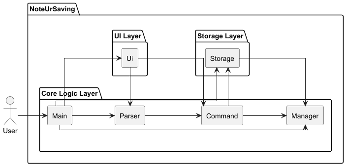

The Architecture Diagram above explains the high-level design of the application

* **Main**: Control the main flow of the application from launch to shut down.
* **Parser**: Parse user input to command that application can execute
* **Ui**: Read user input, display output of user commands, errors and instructions
* **Command**: Executable commands of the application.
* **Storage**: Storing data and settings in hard disk and loading them during the run of application.
* **Manager**: Holds the data while the application is running

### Main
Main will handle the setup and loop to execute the interaction with user

Here are the sequence diagram shows the important features:

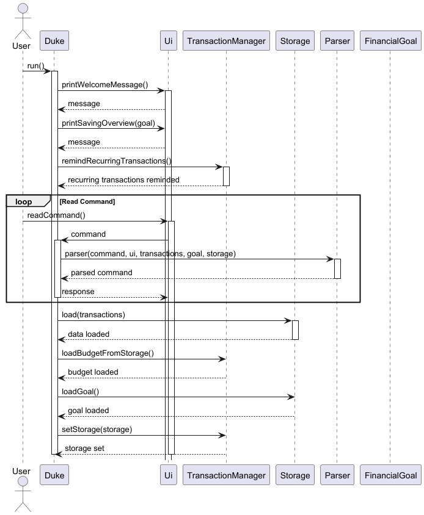

### Storage
Storage will storage all the data in `.txt` and `.csv` file.
Storage will parse the local string data into executable objects.

### UI
The `UI` component contain Ui classes, it will display all message that will be seen by user.
It will also print out errors.


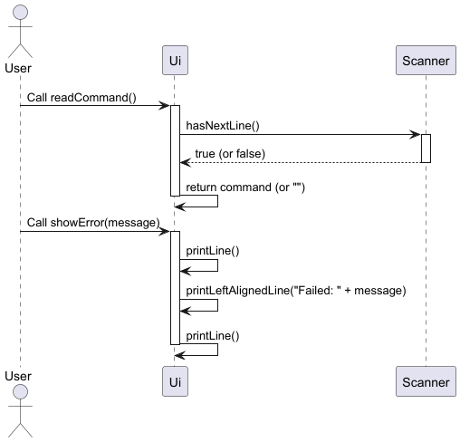

* `readCommand()`: UI works as it takes input from `scanner` and then return it to `parser` as read command
* UI will print output when the command is executed.

Here are an example when UI handle user commands:
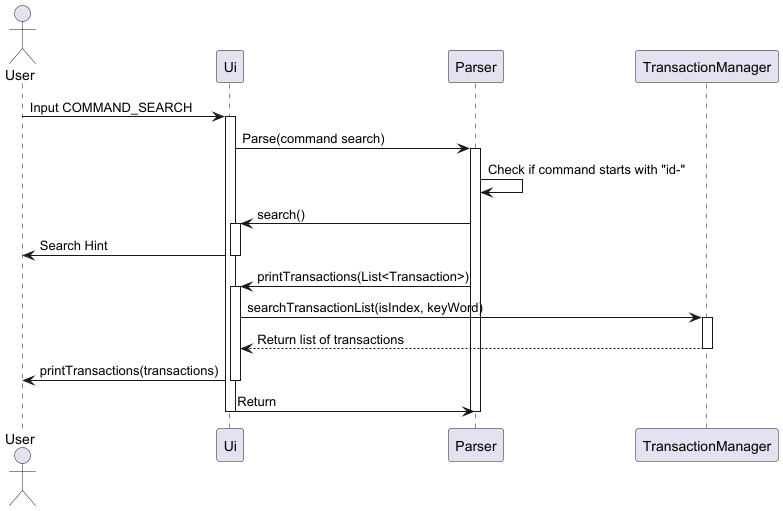

`UI` Takes in User input and pass it to `Parser`. `Parser` parse input into a command and execute that command, and pass the output value to `UI`. Then `UI`
display that output to the User.  
In this case, User type in `search` command. `UI` read that command and pass it to `Parser` to parse and handle it.
`Parser` parse it as a `search` command and execute it by searching in `Manager` component. `Manager` component return the output to `UI` and `UI` display it for Users,

### Parser
The `Parser` component is `Parser` Class. It handles the input `UI` read.

As the example shows in `UI` segment, `Parser` parse and execute the user input.

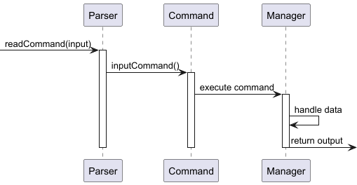

`Parser` parse input to command and pass it to `Command` to handle

When `Parser` get invalid input, it will throw exceptions and let `UI` print the error directly.

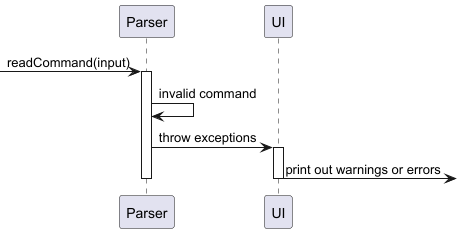

### Command
`Command` component contains lots of command class, they were called when `Parser` receive valid command and execute the following code

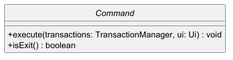

`Command` class contain two main method, and all other `command` component will extend from this class.
`Command` will execute code inside `execute()` method, such as `deleteCommand` will delete `transactions` in `execute`.

### Manager
`Manager` component is used for managing data while the application is running.
They store data in memory.
So `Manager` should contain methods to operate data such as `add` `delete`.
`Manager` would not save data to local, but `Storage` will store them automatically.

## Implementation

### Transaction Basic Data Structure

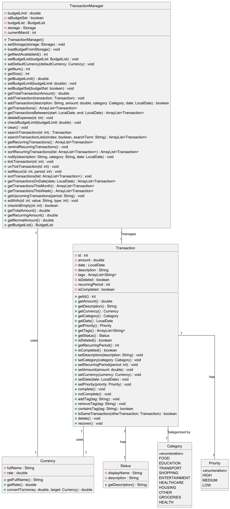

**Feature Description:**  
The `Transaction` class serves as the fundamental data structure for managing financial transactions in our application. It encapsulates essential information about each transaction, providing a structured way to store and manipulate transaction data. The class includes the following fields:

- `id` (Transaction ID)
- `description` (Transaction description)
- `amount` (Transaction amount)
- `currency` (Currency type)
- `category` (Transaction category)
- `date` (Transaction date)
- `status` (Transaction status)

added the ability to set the period at which expenses recur, stored in the `recurringPeriod` field.

Additionally, the Transaction class provides a field to mark whether a transaction has been deleted (isDeleted), which allows the application to logically delete a transaction while preserving data integrity.

`Currency`, `Category`, `Priority` and `Status` are `enum`.

### Managing Transactions with TransactionManager

The `TransactionManager` class plays a central role in managing the collection of Transaction objects. It functions as a memory-based manager, providing methods for adding, deleting, and updating transactions. The class operates using an ArrayList<Transaction>, which is used to store all active transactions.

Key functionalities in the TransactionManager class include:

* `addTransaction():` This method allows the addition of new transactions to the list. If the transaction is recurring, the recurringPeriod is set to the specified value, and the transaction is added to the memory list. It also ensures that the transaction ID is unique, incrementing the ID counter if necessary.
* `getTransactions():` This method returns a list of all non-deleted transactions. It filters out deleted transactions and sorts the remaining transactions based on their date to maintain chronological order.
* `deleteTransaction(int id):` Marks a transaction as deleted, ensuring it is excluded from future operations without physically removing it from the storage. This method prevents accidental deletion of data and maintains data consistency.
* `getTotalTransactionAmount():` This method calculates the total amount of all non-deleted transactions, helping users track their total spending and income.
* `getRecurringTransactions():` This method returns a list of recurring transactions that are scheduled to occur in the future. It allows for managing subscriptions, rent payments, and other periodic expenses.

**Implementation Consideration:**  
The Transaction class and the TransactionManager class work together to form a powerful, flexible solution for managing financial transactions in a budgeting application. Here are the key considerations:
* **Data Integrity:** Using isDeleted flags instead of removing transactions helps maintain historical data, which is important for audit purposes and for users who might want to review or restore previous transactions.
* **Recurrence Support:** The addition of the recurringPeriod field allows for the management of recurring transactions. This feature is particularly useful for users who need to track regular payments like subscriptions, rent, or salaries.
* **Currency and Category:** Standardization: The use of Currency and Category enums ensures that all transaction entries are consistent and categorized appropriately. This makes it easier to filter, report, and analyze transactions by type or currency.
* **Memory Management:** The ArrayList is chosen as the underlying data structure for its simplicity and efficiency in managing dynamic data sets. However, as the number of transactions grows, the application may need to transition to more advanced storage solutions, such as databases, to handle larger data sets efficiently.
* **Budget Management:** The TransactionManager class allows for budget constraints to be set, which is essential for managing user expenses. The system warns users when they are nearing or exceeding their budget, helping users keep track of their financial limits.


---

### Transaction Management Features: Tick, Add, Exit, List


**Feature Description:**  

* Mark Transaction: Allows users to mark a transaction with a specific status (Completed or Pending).
* Add Transaction: Users can add a new transaction with description, amount, category, and other attributes.
* List Transaction: User can list all the transactions in the manager.
* Exit Program: Exits the program and ensures any unsaved transactions are stored.


**Design Consideration:**  
These functionalities allow the program to provide basic transaction management capabilities. <br>
Searching and adding transactions is streamlined for ease of use, and the exit process is handled to ensure data
persistence.

---

### Transaction Management Features: Delete, Set Budget Limit, Notifications and Summary

##### Deletion


#### Set Budget


#### Notification 
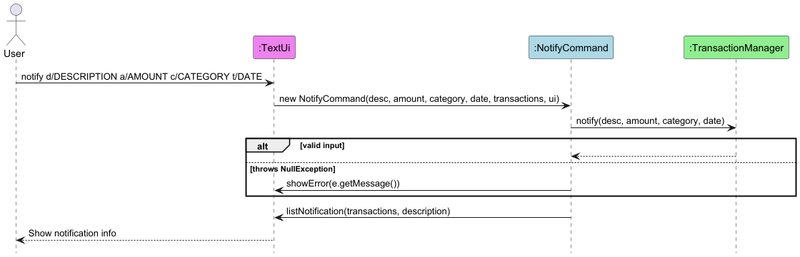

#### Summary 
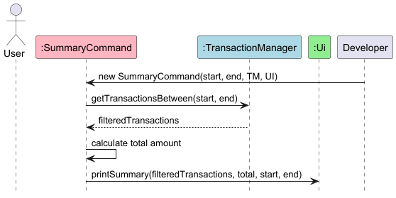

**Feature Description:**
* Delete Transaction (delete): Lets users remove unwanted or erroneous transaction entries using their index in the displayed list.
* Set Budget Limit (setBudget): Enables users to define a spending cap to avoid overspending. Once the total recorded expenses exceed this limit, a warning is displayed to alert the user.
* Set Notifications for Upcoming Payments (notify): Allows users to schedule reminders for future expenses based on the transaction's description, amount, category, and due date.
* Summary of Expenses (summary): Provides an overview of expenses for a specified time frame, enabling quick and effective financial review.

**Design Consideration:**  

The `deletion`, `budget limit` and `notification` features are designed to improve financial awareness and discipline.
Users can monitor their spending relative to a predefined threshold and receive timely reminders for future payments.

Expense summaries provide users with quick, insightful overviews of their spending patterns within a selected time frame, enhancing their ability to review and adjust financial behavior promptly.

These capabilities integrate seamlessly with the transaction management system, enhancing the user experience through automation
and clear visual cues for overspending or pending transactions.

---

### Transaction Management Features: Alert, Set Priority and Convert Currency function 

##### Alert Operation  
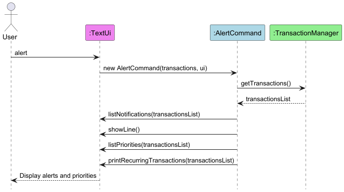

##### Set Priority  


##### Convert Currency
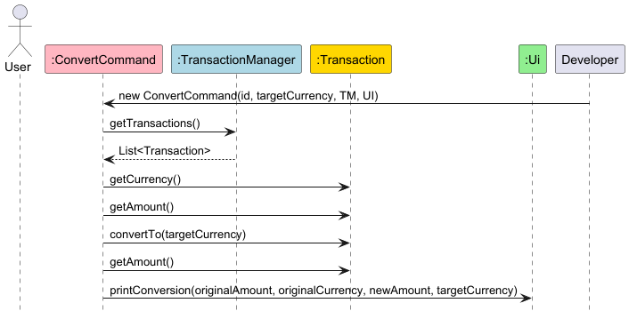

**Feature Description:**
* Set Priority (priority): Allows users to assign a priority level (low, medium, or high) to a transaction. By default, all expenses are low priority. This helps users focus on the most urgent or important expenses.

* View Spending Alerts (alert): Displays an overview of upcoming expenses, recurring payments, current remaining budget, and whether the spending has exceeded the set budget limit. This command combines notification, priority, and budget insights in a single view.

* Convert Currency (convert): Allows users to convert the amount of a transaction from its original currency to a specified target currency. This is particularly useful for users tracking multi-currency expenses or international purchases.

**Design Consideration:**

Priority levels help users organize and focus on transactions based on importance or urgency.

Spending alerts consolidate relevant financial insights—notifications, recurring transactions, and budget status—into 
one unified interface for quick decision-making.

The convert feature adds a layer of flexibility for users dealing with multiple currencies. It simplifies financial tracking by converting values into a uniform currency for easier comparison and understanding. It is designed with immediate feedback through the UI to help users understand how currency changes affect their recorded transactions. 
The conversion is performed using the transaction's stored data and is integrated directly into the TransactionManager, ensuring that currency changes do not interfere with other transaction attributes or analytical features.

---

### Transaction Management Features: Set Recurring Period

**Feature Description:** <br>
Allows users to set transactions to recur every `recurringPeriod` days. <br>


**Design Consideration:**  
The ability to set recurring period allows users to manage subscriptions or bills without having to add them
repeatedly. The user is given the freedom to set `recurringPeriod` to any positive integer of their choice instead of 
being limited to a handful of options (e.g. Daily, Weekly, Monthly) to account for unconventional billing cycles.

---

### Transaction Management Features: Search

**Feature Description:** <br>
Allows users to search through list of transactions by either description (default) or id. <br>\
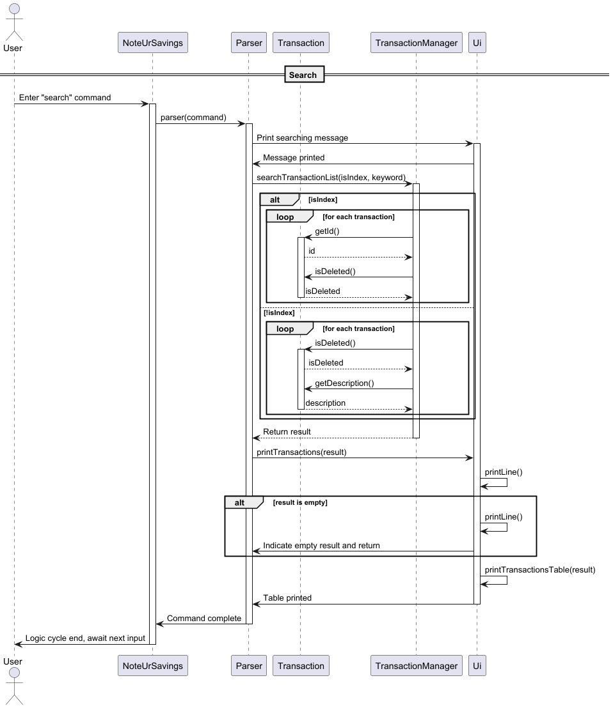

```java
public ArrayList<Transaction> searchTransactionList(boolean isIndex, String searchTerm) throws Exception {
    try {
        ArrayList<Transaction> result = new ArrayList<>();
        if (isIndex) {
            // Searches for transaction with given index and adds to result
        } else {
            // Searches for all transactions whose description contain the search term and adds to result
        }
        return result;
    } catch (Exception e) {
        // Error handling
    }
}
```

**Design Consideration:**  

This feature allows for flexible search input, where users may search by either description or id. Transactions marked
as deleted are ignored by this method, to avoid cluttering of potentially unwanted results whilst avoiding full 
deletion. <br> <br>
Unlike in the skeleton shown above, the actual implementation actually catches two types of errors, a 
`NumberFormatException` and a general `Exception`, and throws their respective `InvalidCommand()` accordingly. 
This is due to the need to parse the searchTerm into an integer when it is a search by index, while accounting for the 
possibility of other errors that may occur in the process.

---

### Transaction Management Features: Edit

**Feature Description:** <br>
Allows users to edit the description, category, amount, or currency of a transaction. <br>
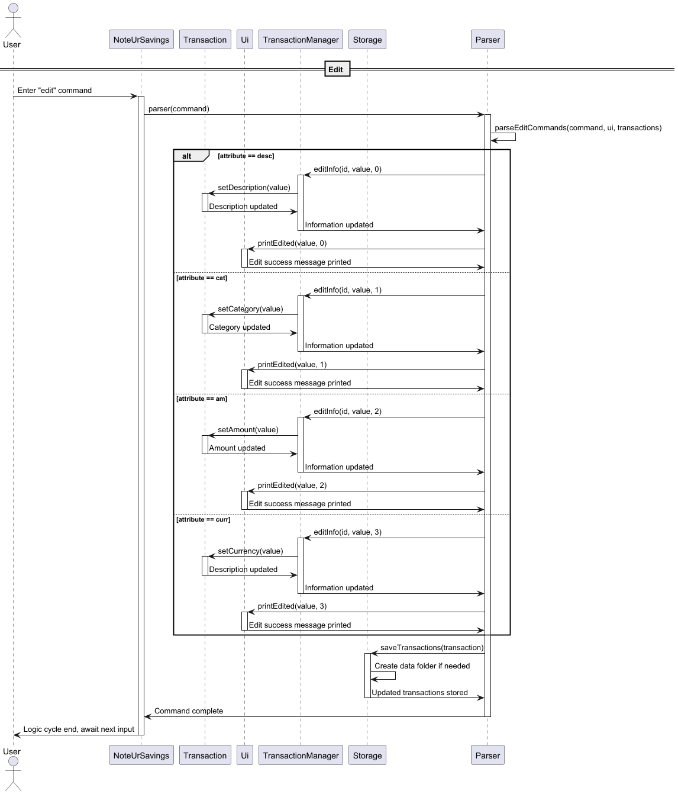

```java
public void editInfo(int id, String value, int type) throws Exception {
    if (checkIdEmpty(id)) {
        return;
    }
    Transaction t = searchTransaction(id);
    
    // switch-case to update transaction
}
```

**Design Consideration:**  
This method checks whether the specified transaction exists before proceeding, preventing potential null pointer 
exceptions. A single unified method is used for ease of further development. Exceptions are thrown when an invalid 
attribute is read given the field to edit.

---

### Transaction Management Features: Remind Recurring Transactions

**Feature Description:** <br>
Reminds user about recurring transactions upon startup. <br>
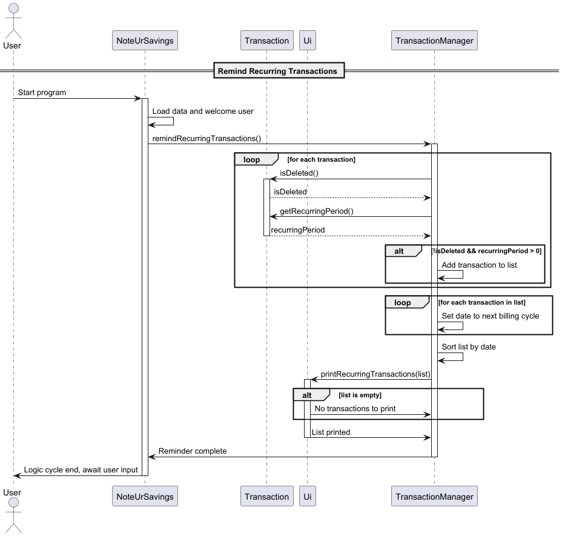

```java
public ArrayList<Transaction> getRecurringTransactions() {
    ArrayList<Transaction> upcoming = new ArrayList<>();
    for (Transaction t : transactions) {
        // Add recurring transactions to upcoming
    }
    // Sort upcoming and return sorted list
}
```

**Design Consideration:**  
This feature is split across three methods that are responsible for data filtration, data transformation, and UI 
interaction respectively. Drawing clear boundaries between parts of this feature eases debugging and future development.

---

### Transaction Management Features: Filter by date, Currency Conversion, Sort by date

`Faheem Akram` added the following functionalities to manage transactions:

* Upcoming Transactions (`getUpcomingTransactions`): Allows users to get transactions for an upcoming date
* Convert Currency (`convertTo`): Allows users to change from one currency to another

```Java
public ArrayList<Transaction> sortTransactions(ArrayList<Transaction> transactions) {

        transactions.sort((t1, t2) -> {
            if (t1.getDate() == null && t2.getDate() == null) {
                return 0;
            }
            if (t1.getDate() == null) {
                return -1;
            }
            if (t2.getDate() == null) {
                return 1;
            }
            return t1.getDate().compareTo(t2.getDate());
        });

        return transactions;
    }

public void getUpcomingTransactions(String period) {

    period = period.toLowerCase();
    switch (period) {
        case "today":
            System.out.println(getTransactionsOnDate(LocalDate.now()));
        case "week":
            System.out.println(getTransactionsThisWeek());
        case "month":
            System.out.println(getTransactionsThisMonth());
        default:
            try {
                LocalDate date = LocalDate.parse(period);
                System.out.println(getTransactionsOnDate(date));
            } catch (Exception e) {
                System.out.println("Invalid period. Use 'today', 'week', 'month', or a date (yyyy-mm-dd)");
            }
    }
}
```

**Design Consideration:**
The ability to sort by and filter by date allows for the user to quickly find what the soonest transactions will be
so that they can plan accordingly.

---


### Transaction Management Features: Currency Conversion

`Faheem Akram` added the following feature:

* Sort by date (`sortTransactions`): Sorts transactions by date

```Java
public void convertTo(Currency currency) {
double toSGD = 1/this.currency.getRate();
this.amount = currency.getRate() * toSGD;
this.currency = currency;
}
```

**Design Consideration:**

This allows for users to effectively convert between different common currencies.

---

### Goal:

### Financial Goal Basic Data Structure

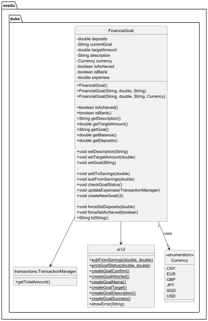

The `FinancialGoal` class represents a financial goal with a target amount, description, and current savings balance.
It allows the user to set and update goal properties, track savings and expenses, and interact with the user. It 
includes the following fields:

- `deposits` (Total savings deposited)
- `currentGoal` (Goal name)
- `targetAmount` (Goal target)
- `description` (Goal description)
- `currency` (Goal currency type)
- `isAchieved` (Goal achieved status)
- `isBlank` (Whether the goal has been initialized)
- `status` (Total expenditure in transactions) <br>
  
```Java
public class FinancialGoal {
    private double deposits;
    private String currentGoal;
    private double targetAmount;
    private String description;
    private Currency currency;

    // Changeable fields

    private boolean isAchieved;
    private boolean isBlank;
    private double expenses;
  
    // Methods
}
```

Commands for the `FinancialGoal` class were integrated into the program through the `Parser` class.

```java
public static void parseGoalCommands(String command, Ui ui, FinancialGoal goal) throws Exception {
    switch (command) {
    case GOAL_TARGET:
        // Command to update target
    case GOAL_DESC:
        // Command to update description
    case GOAL_TITLE:
        // Command to update title
    case GOAL_STATUS:
        // Command to view status
    case GOAL_NEW:
        // Command to create a new goal
    default:
        // View goal (default) / create new goal (if empty)
    }
}
```

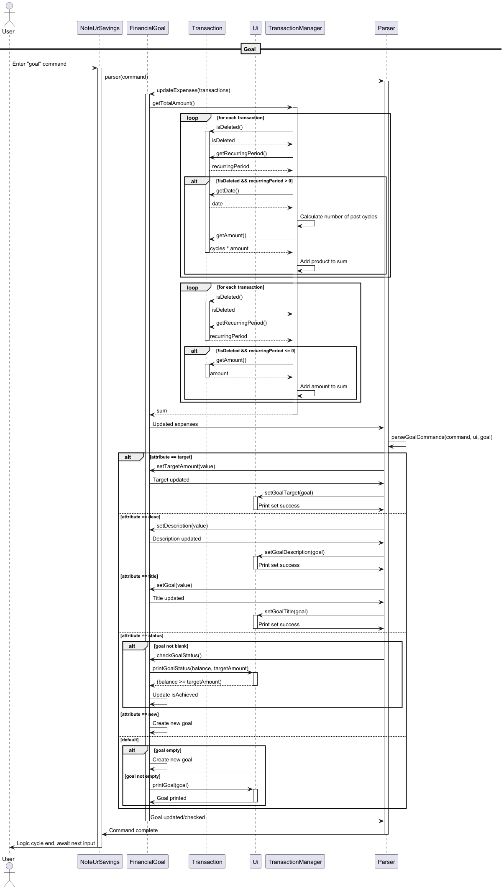

---

### Goal Management Features: Create

**Feature Description:** <br>
Creates a new `FinancialGoal` object. <br>
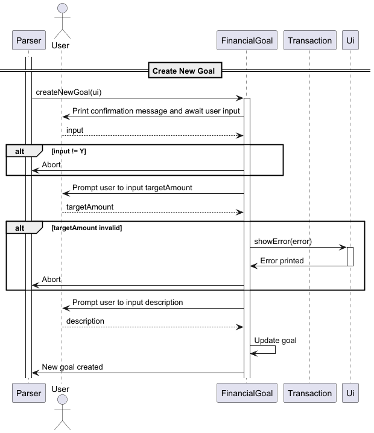

```Java
public void createNewGoal(Ui ui) {
    // Read confirmation

    if (!sc.nextLine().equalsIgnoreCase("Y")) {
        // Aborted
    }

    // Read name
  
    try {
        // Read amount
        if (amount <= 0) {
            // Aborted due to invalid input
        }
    } catch (NumberFormatException e) {
        // Error handling
    }

    // Assign to goal
}
```

**Design Consideration:**

This method enables creation of a goal based on user input at runtime, created a very linear and guided experience for 
users. The numeric input is checked for validity before being logged, ensuring integrity of the object by catching 
number format errors early. Informative messages are printed through the UI class, guiding the user throughout and 
informing them of any errors they make.

---

### Goal Implementation: Integration with Transactions to Reflect Balance

**Description:** <br>
Originally, `FinancialGoal` and `TransactionManager` operated asynchronously. At a later stage, expenses were 
integrated with deposits made to calculate balance to better reflect progress made towards the set goal. 
`goal.updateExpenses(transactions)` is run each time a goal command is sent to ensure that the progress shown 
is accurate.
<br> <br>
The total expenditure is calculated through adding `getRecurringAmount()` and `getNormalAmount`.

```java
public int getRecurringAmount() {
    int sum = 0;
    for (Transaction transaction : transactions) {
        if (transaction.getRecurringPeriod() > 0 && !transaction.isDeleted()) {
            long daysBetween = ChronoUnit.DAYS.between(transaction.getDate(), LocalDate.now());
            sum += transaction.getAmount() * (int)((double) daysBetween / transaction.getRecurringPeriod() + 1);
        }
    }
    return sum;
}

public int getNormalAmount() {
    int sum = 0;
    for (Transaction transaction : transactions) {
        if (transaction.getRecurringPeriod() <= 0 && !transaction.isDeleted() && transaction.isCompleted()) {
            sum += transaction.getAmount();
        }
    }
    return sum;
}
```

**Design Consideration:**  
`getRecurringAmount` returns the sum of all past cycles of the transaction up until the current date. <br>
`getNormalAmount` returns all completed one-time transactions. <br>
Both ignore transactions labeled as deleted to avoid factoring in unwanted records.
<br> <br>
The total expenditure is calculated before `goal` commands are executed instead of every time `transactions` is 
updated. This saves both time in processing and lines of code as this implementation only requires a singular instance 
of this command being called each time the user wishes to check their progress.

---

## Product scope

### Target user profile

**User Type: University Students**

Demographics:

* Age: 18-25
* Education Level: Undergraduate or Graduate Students
* Financial Situation: Limited budget, dependent on allowances, scholarships, or part-time income

Pain Points:

* Struggles with tracking daily expenses
* Finds it difficult to stay within a budget
* Lacks awareness of spending habits and financial discipline
* Needs reminders to avoid overspending

Needs & Expectations:

* A simple and intuitive way to record transactions
* A budget-setting feature to manage monthly or weekly expenses
* Notifications or alerts when spending exceeds set limits
* A lightweight, user-friendly interface without complex financial jargon

Behavior & Technology Use:

* Prefers mobile apps or web-based solutions for quick access
* Uses digital payment methods (credit/debit cards, mobile wallets)
* May not have prior experience with financial management tools

Ideal Solution:  
A straightforward financial management tool that helps students easily track expenses
, set spending limits, and receive reminders to avoid exceeding their budget.

### Value proposition

This financial management tool helps university students take control of their spending by providing a simple way to record transactions
, set budget limits, and receive spending alerts. It solves the problem of poor financial tracking and overspending by offering a user-friendly 
platform that promotes better money management without overwhelming users with complex financial features.

## User Stories

| Version | As a ... | I want to ...                                         | So that I can ...                                                                |
|---------|----------|-------------------------------------------------------|----------------------------------------------------------------------------------|
| v1.0    | user     | delete financial information                          | correct any upcoming changes in regards to my finances.                          |
| v1.0    | user     | add financial information                             | keep track of my financial goals.                                                |
| v1.0    | user     | set a financial goal                                  | track the financial goal                                                         |
| v1.0    | user     | search through my expenses                            | keep better track of expenses I have to pay for                                  |
| v1.0    | user     | label my expenditures                                 | remember why I want to spend that money                                          |
| v1.0    | user     | tick off my expenditures                              | remember what I have bought and what I haven’t                                   |
| v1.0    | user     | set budget limits                                     | limit the amount of purchases I add.                                             |
| v1.0    | user     | create recurring transactions                         | keep track of regular payments such as subscriptions easily.                     |
| v1.0    | user     | correct financial information                         | mistaken by incorrect financial goals.                                           |
| v2.0    | user     | receive alerts                                        | control it when my spending is higher than usual and have upcoming payments.     |
| v2.0    | user     | prioritise specific expenses                          | see what sort of expenses I should focus on first place.                         |
| v2.0    | user     | receive the reminders for upcoming recurring payments | don’t miss a payment deadline.                                                   |
| v2.0    | user     | view a summary of my expenses for a given time frame  | can get quick information about my finances when I need it.                      |
| v2.0    | student  | document project expenses                             | control the budget granted and to request reimbursements.                        |
| v2.0    | student  | synchronize the expenditures with balances            | can manage the savings better and see any differences.                           | 
| v2.0    | student  | see 5-10 different types of currencies                | can convert back to my home currency when I need to, like USD, SGD, EUR and CNY. |


## Non-Functional Requirements

1. Usability: The interface should be intuitive and easy to navigate, ensuring a smooth user experience for students with minimal financial management knowledge.

2. Performance: The application should be lightweight and responsive, allowing users to quickly log transactions and check their budget without delays.

3. Scalability: The system should be able to handle an increasing number of transactions and users as adoption grows.

4. Security: Users’ financial data should be securely stored and encrypted to protect sensitive information.

5. Availability: The system should maintain high availability, ensuring users can access their financial records at any time.

6. Compatibility: The tool should be accessible across different devices (e.g., smartphones, tablets, and desktops) with a responsive design.

7. Maintainability: The codebase should be well-documented and modular, allowing for easy updates and improvements in the future.

8. Notifications & Alerts: The system should send timely reminders and alerts without causing excessive interruptions or spam.

## Instructions for manual testing

### Preparation
* Initialize Application: Start the application and ensure all files are wokring well.

### Test Case

1. Add Transaction Using Wizard
   * Steps: 
      1. Input the command add with no additional parameters (e.g., add).
      2. Follow the prompts provided by the AddWizardCommand to input transaction details (e.g., description, amount, category, date).
   * Expected Results:
     1. The transaction should be successfully added to the transactions list.
     2. The UI should display the newly added transaction.
     3. The storage should update with the new transaction.
   * Edge Case: Input invalid or blank data during the wizard process and verify error handling.

2. Add Transaction Using Inline Parameters
    * Steps:
      1. Input the command with inline parameters (e.g., add d/Lunch a/15.50 c/Food t/2023-04-07).
      2. Verify that the parameters are parsed correctly.
    * Expected Results:
      1. A transaction with the specified details is added to the transactions list.
      2. The UI displays the added transaction.
      3. The storage is updated with the new transaction.
    * Edge Cases:
      1. Missing optional t/ field: Verify that the current date is used if date is not provided.
      2. Incorrect or malformed parameters (e.g., add d/Lunch a/abc c/Food): Ensure appropriate error messages are displayed.
      3. Empty or blank parameter values: Verify that missing non-optional fields throw an InvalidCommand exception.
      


